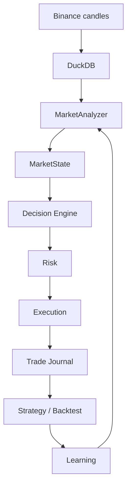

# Architecture

## Слои

### 1. Data Layer

- `ai/data_collector` загружает свечи и сохраняет их в DuckDB.
- Источник данных сейчас ориентирован на Binance через `ccxt`.

### 2. Market Intelligence Layer

- `ai/market/analyzer.py` читает свечи из базы.
- Формирует `MarketState` для symbol + timeframe.
- Возвращает режим рынка, тренд, волатильность и рекомендацию.

### 3. Orchestration Layer

- `core/director.py` запускает цепочку агентов.
- `MarketAgent` наполняет `ctx.market`.
- `StrategyAgent` генерирует стратегию.
- `StrategyValidator` проверяет синтаксис.
- `BacktestAgent` запускает backtest.
- `BacktestAgent` находит фактический export artifact Freqtrade в `user_data/backtest_results`.
- `LearningAgent` собирает результат для следующей итерации.

### 4. Strategy Layer

- `agents/strategy` отвечает за генерацию стратегии.
- LLM используется только как генератор кода, а не как единственный источник решения.

### 5. Risk Layer

- `agents/risk` вычисляет размер позиции и защитные уровни.
- Использует `decision` и `market` для адаптации параметров.
- Должен быть skip-aware, если решение уже `wait`.

### 6. Execution Layer

- `agents/execution` формирует intent и исполняет его в `paper` или `live` режиме.
- Этот слой отделен от генерации стратегии и получает вход только от decision + risk + market.
- Пишет trade intents и результаты в `ai/trading/journal.py`.

### 7. Learning Layer

- `agents/learning` читает журнал закрытых сделок и backtest результаты.
- Для backtest поддерживается чтение как `json`, так и `zip`-архива с json report внутри.
- Выделяет winrate, profit factor, average PnL и типичные ошибки.
- Формирует рекомендации для роста прибыли и снижения просадок.

## Поток данных

## Принципиальные правила

- Не смешивать R&D и execution в одном модуле.
- Не торговать без risk management.
- Сначала paper trading, потом live trading.
- Решение `wait` должно быть нормальным и частым результатом.
